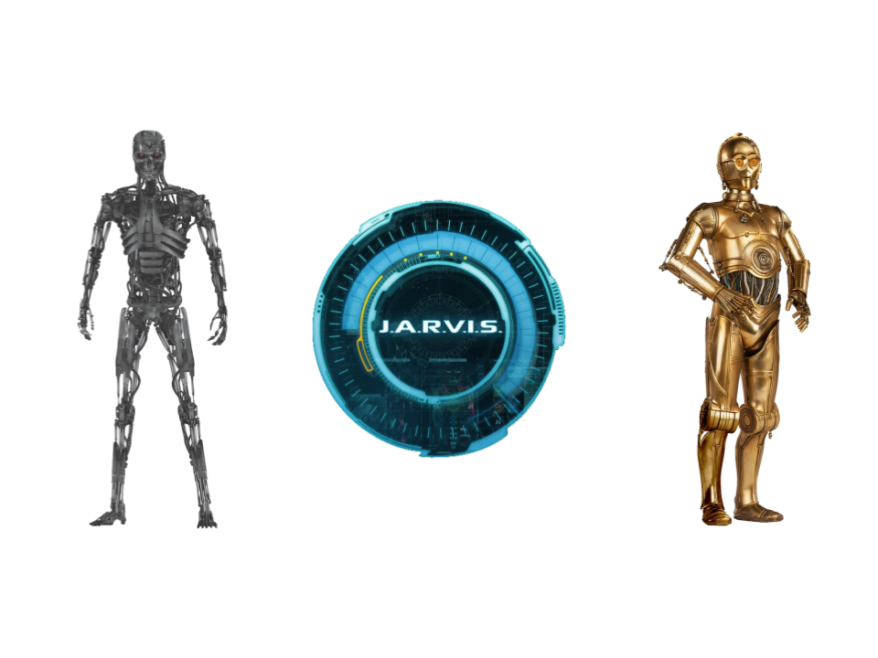
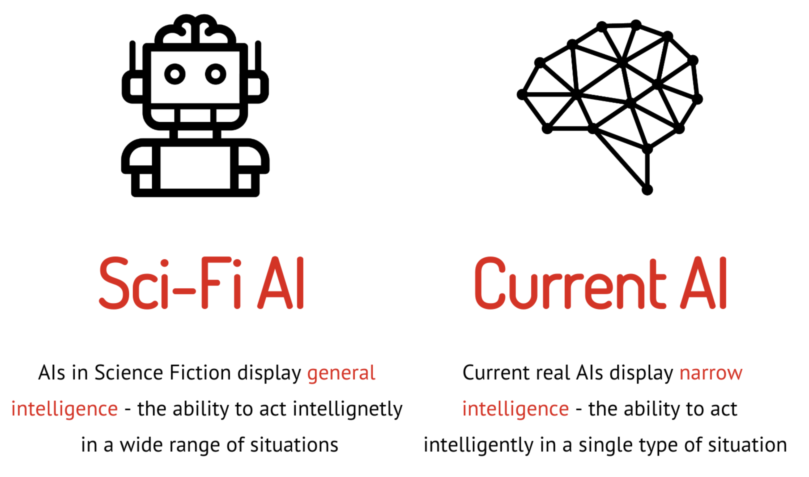
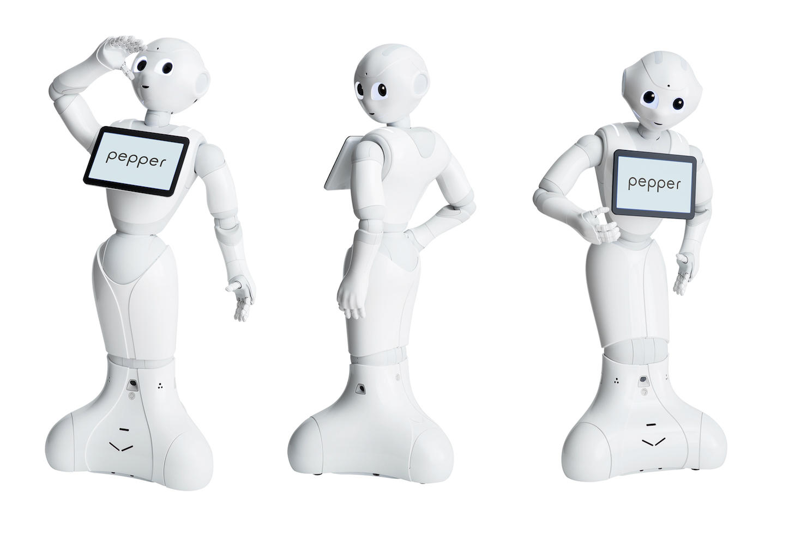
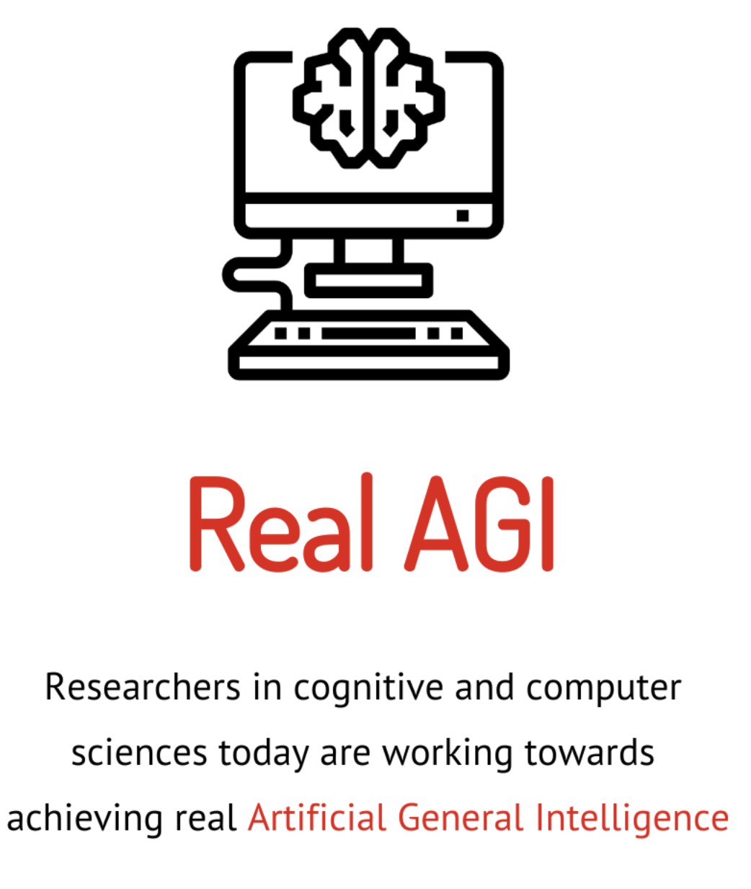

When people think about Artificial Intelligence, they tend to refer to science fiction – A few examples include the Terminator, JARVIS (Iron Man), and C-3PO (Star Wars). But how close are these sci-fi interpretations to reality?

<!-- 

 

 -->

The major point of disconnect between AIs in sci-fi and real AI is the size of their intelligence application space. What this means is that the AI in movies tend to have what is called *general intelligence*, the ability to act intelligently in a wide range of situations, just as humans do.  Conversely, real-life AI has what is called *narrow intelligence*, meaning that the AI can act intelligently in a single type of situation, but not in all types of situations.

 

  

For example, one of the current cutting-edge AIs is Google’s AlphaZero, a game-playing AI which has mastered the games of Chess, Shogi (a Japanese variant of Chess), and Go (a Chinese strategy board game similar to Chess). While this AI can easily beat human world champions of each aforementioned board game, anyone could easily best the AI in a simpler game, such as Checkers or Snakes and Ladders. This game-playing AI cannot even play every game, let alone perform tasks in a larger problem space, such as speaking a human language, or understanding what human emotion.  

 
 <figcaption> <em> AlphaZero is world-renowned for it's mastery of the games Chess, Shogi, and Go. However, it is unable to perform any other, seemingly simpler tasks. </em> </figcaption>

This is not, however, to say that certain AIs cannot speak or understand cues to human emotion. They just must be built for that specific purpose, and will not be able to, for example, play Chess. For instance, Softbanks’s humanoid robot named Pepper is a greeting and information bot which is able to recognize human emotions based on facial expression. While Pepper is able to understand the complexities of human facial expression, he can not recognize any other visual characteristics, such as race, gender, or height; let alone beat even a novice at Chess.

 
 <figcaption> <em> Pepper is able to recognize faces and basic human emotions, and can engage in conversation with humans through his touch screen. He can not, however, do anything else, such as tell how tall you are, or play a game with you. </em> </figcaption>

 A final examples is Google’s DeepMind breast cancer detector, which outperforms human radiologists at detecting breast cancer, but would not be able to detect the presence of any other type of cancer or illness. These examples demonstrate the current state of AI – we are able to build machines that are very intelligent with respect to a single problem space, but we cannot build a machine with even toddler-level generalized intelligence.

To sum up, the AI in sci-fi displays general intelligence, while the AI in real life does not. However, researchers in the philosophy of intelligence, as well as cognitive and computer sciences, are currently attempting to take steps towards achieving Artificial General Intelligence. When reasoning about AGI, two main paths tend to be identified – one is to replicate the structure of the human brain, and the other is to create some functional equivalent to the human brain with different structure. When reasoning about either path, there are three major barriers that arise:

1. The human brain has not been fully mapped by neuroscience – there are still many things about brain functioning and structure that we do not understand.

2. The computational “neurons” used in neural networks (the structures used to build AIs) are not the same as biological neurons –  computational neurons are much simpler, and thus are not able to convey as much information per neuron as biological neurons are able to.  In addition, biological neurons are much faster and more energy efficient than computational ones. Thus, biological neurons can carry more information in less time using less energy compared to computational ones.

3. The issue of computing power – the human brain is estimated to operate at 1 exaFLOP, which means it can perform one billion billion (1,000,000,000,000,000,000 ) calculations per second. In comparison, the fastest supercomputer in the world, named Fugaku, operates at 415.5 petaFLOPs, approximately 42% of the computing power of the human brain. It is also interesting to note that Fugaku is an extremelly large machine, filling a large room with hardware, therefore is nowhere near as space-efficient as the human brain. Thus, even if we were able to map the entire brain, and accurately computationalize biological neurons, we still do not have the hardware to make this possible.

 

While these barriers may make it seem that AGI is a fully unachievable goal, there is still hope for achieving AGI – after all, most technological innovations seemed impossible before they were realized. In fact, many such innovations were actually inspired by science fiction – for instance, the original Star Trek TV series from the 1960’s, is often cited as inspiration for the development of Bluetooth headsets, cell phones,  and touch-screen tablets. On a darker note, the Skynet from Terminator, an AI whose goal is to extinguish humanity, is eerily similar to the US Army ATLAS AI – an automated system for acquiring, identifying, and targeting threats. That is to say, we may be able to build AGIs like JARVIS, C-3PO, or the Terminator at some point in the *distant* future, but only after massive innovation in neuroscience, neural network building practices, and super-computing technology.
